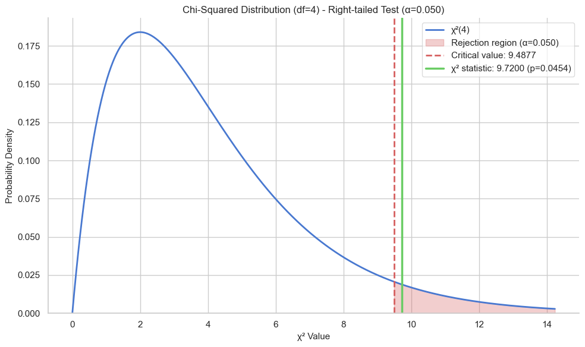
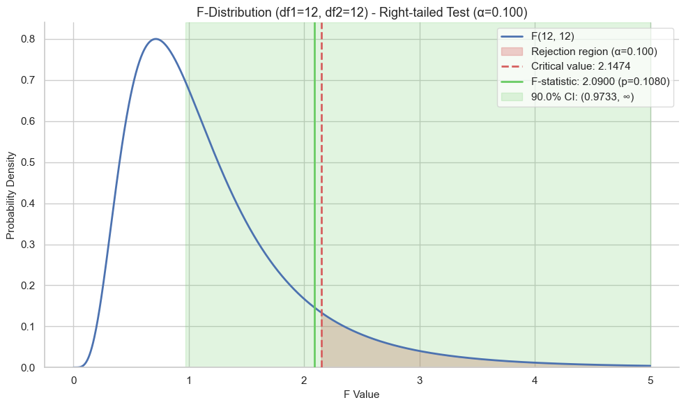
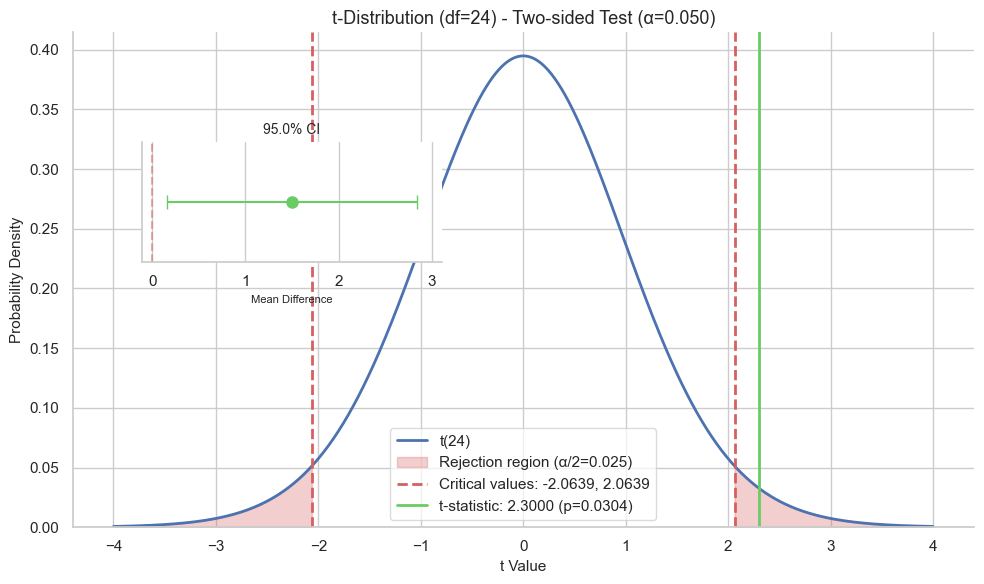
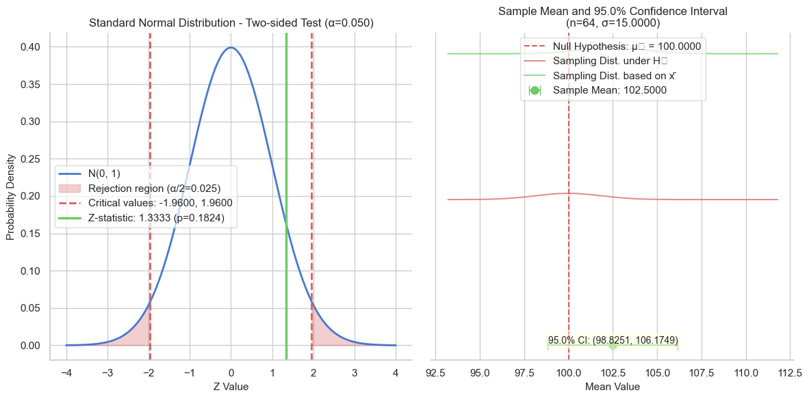

# Statistical Testing Library

A comprehensive Python library for statistical hypothesis testing and distribution analysis with visualization capabilities.

## Overview

This library provides an easy-to-use interface for working with common statistical distributions used in hypothesis testing:

- **Chi-Square Distribution**: For categorical data analysis and goodness-of-fit tests
- **F Distribution**: For comparison of variances and ANOVA
- **t Distribution**: For small sample hypothesis tests with unknown population variance
- **Z Distribution**: For large sample hypothesis tests with known population variance

Each module offers statistical calculations, hypothesis testing, and beautiful visualizations powered by Matplotlib and Seaborn.

## Installation

### Prerequisites

- Python 3.6+
- NumPy
- SciPy
- Matplotlib
- Seaborn

### Install using pip

```bash
pip install git+https://github.com/pablorocg/statistical-design-and-analysis-of-experiments.git
```

Or clone the repository and install locally:

```bash
git clone https://github.com/pablorocg/statistical-design-and-analysis-of-experiments.git
cd statistical-design-and-analysis-of-experiments
pip install -e .
```

## Quick Start

Import the library and use the analysis functions for each distribution:

```python
from src import analyze_chi_squared, analyze_f_distribution, analyze_t_distribution, analyze_z_distribution

# Example: t-test analysis
results, fig = analyze_t_distribution(
    df=20,               # Degrees of freedom
    alpha=0.05,          # Significance level
    alternative="two-sided",  # Test type
    t_stat=2.5,          # Test statistic
    mean_diff=0.8,       # Mean difference
    std_error=0.32       # Standard error
)

print(format_t_results(results))  # Print formatted results
```

## Features

- Calculation of critical values, p-values, and confidence intervals
- Support for different hypothesis testing approaches (two-sided, greater, less)
- Beautiful visualizations of distributions with critical regions
- Comprehensive result formatting
- Type hinting for improved IDE integration

## Usage Examples

### Chi-Square Analysis

```python
from src import calculate_chi_squared, visualize_chi_squared, format_chi_squared_results

# Calculate chi-square critical values and test statistics
results = calculate_chi_squared(
    df=5,                  # Degrees of freedom
    chi_stat=11.07,        # Chi-square statistic
    alpha=0.05,            # Significance level
    alternative="two-sided"  # Test type
)

# Format results as readable text
print(format_chi_squared_results(results))

# Create visualization
visualize_chi_squared(results)
```

### F Distribution Analysis

```python
from src import analyze_f_distribution, format_f_results

# Complete F-distribution analysis
results, fig = analyze_f_distribution(
    df1=3,                 # Numerator degrees of freedom
    df2=20,                # Denominator degrees of freedom
    alpha=0.05,            # Significance level
    alternative="greater",  # Test type
    f_stat=3.5,            # F-statistic
    visualize=True         # Create visualization
)

# Display formatted results
print(format_f_results(results))
```

### t Distribution Analysis

```python
from src import calculate_t_critical, visualize_t_distribution, format_t_results

# Calculate t-distribution statistics
results = calculate_t_critical(
    df=25,                 # Degrees of freedom
    alpha=0.01,            # Significance level
    alternative="less",    # Test type
    t_stat=-2.8,           # t-statistic
    mean_diff=-0.75,       # Mean difference
    std_error=0.25         # Standard error
)

# Format and print results
print(format_t_results(results))

# Create visualization
visualize_t_distribution(results)
```

### Z Distribution Analysis

```python
from src import analyze_z_distribution, format_z_results

# Complete Z-distribution analysis
results, fig = analyze_z_distribution(
    mu_0=50,               # Null hypothesis value
    x_bar=52.5,            # Sample mean
    sigma=10,              # Population standard deviation
    n=100,                 # Sample size
    alpha=0.05,            # Significance level
    alternative="greater"  # Test type
)

# Display formatted results
print(format_z_results(results))
```

## API Reference

### Chi-Square Module

- `calculate_chi_squared(df, chi_stat, alpha, alternative)`: Calculate chi-squared distribution statistics
- `visualize_chi_squared(results, show_plot, figure_size)`: Create visualization of chi-squared distribution
- `format_chi_squared_results(results, decimals)`: Format results as readable text
- `analyze_chi_squared(df, chi_stat, alpha, alternative, show_plot, figure_size)`: Complete analysis wrapper

### F Distribution Module

- `calculate_f_distribution(df1, df2, alpha, alternative, f_stat)`: Calculate F-distribution statistics
- `visualize_f_distribution(results, show_plot, figure_size)`: Create visualization of F-distribution
- `format_f_results(results, decimals)`: Format results as readable text
- `analyze_f_distribution(df1, df2, alpha, alternative, f_stat, visualize, show_plot, figure_size)`: Complete analysis wrapper

### t Distribution Module

- `calculate_t_critical(df, alpha, alternative, t_stat, mean_diff, std_error)`: Calculate t-distribution statistics
- `visualize_t_distribution(results, show_plot, figure_size)`: Create visualization of t-distribution
- `format_t_results(results, decimals)`: Format results as readable text
- `analyze_t_distribution(df, alpha, alternative, t_stat, mean_diff, std_error, visualize, show_plot, figure_size)`: Complete analysis wrapper

### Z Distribution Module

- `calculate_z_critical(mu_0, x_bar, sigma, n, alpha, alternative)`: Calculate z-distribution statistics
- `visualize_z_distribution(results, show_plot, figure_size)`: Create visualization of z-distribution
- `format_z_results(results, decimals)`: Format results as readable text
- `analyze_z_distribution(mu_0, x_bar, sigma, n, alpha, alternative, visualize, show_plot, figure_size)`: Complete analysis wrapper

## Parameter Details

| Parameter | Description |
|-----------|-------------|
| `df` | Degrees of freedom |
| `df1` | Numerator degrees of freedom for F-distribution |
| `df2` | Denominator degrees of freedom for F-distribution |
| `alpha` | Significance level (default: 0.05) |
| `alternative` | Test type: "two-sided", "greater", or "less" |
| `chi_stat` | Chi-square statistic |
| `t_stat` | t-statistic |
| `f_stat` | F-statistic |
| `mu_0` | Null hypothesis value |
| `x_bar` | Sample mean |
| `sigma` | Population standard deviation |
| `n` | Sample size |
| `mean_diff` | Mean difference |
| `std_error` | Standard error |
| `show_plot` | Whether to display the plot (default: True) |
| `figure_size` | Size of the figure for visualization (tuple) |
| `visualize` | Whether to create a visualization (default: True) |
| `decimals` | Number of decimal places for formatting (default: 4) |

## Examples of Visualization Output

When using visualization functions, you'll get attractive plots showing the distribution, critical regions, and test statistics:

### Chi-Square Example


### F Distribution Example


### t Distribution Example


### Z Distribution Example


## Planned Features

- ANOVA implementation
- Non-parametric tests
- Bootstrap confidence intervals
- Power analysis tools
- DoE (latin squares, factorial designs, RSM, ...)

## License

This project is licensed under the MIT License - see the LICENSE file for details.

